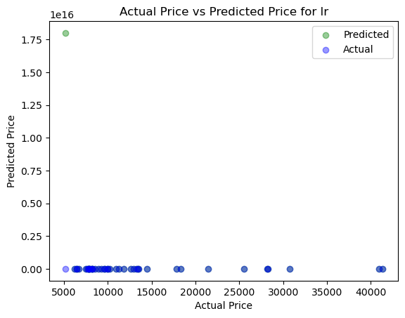
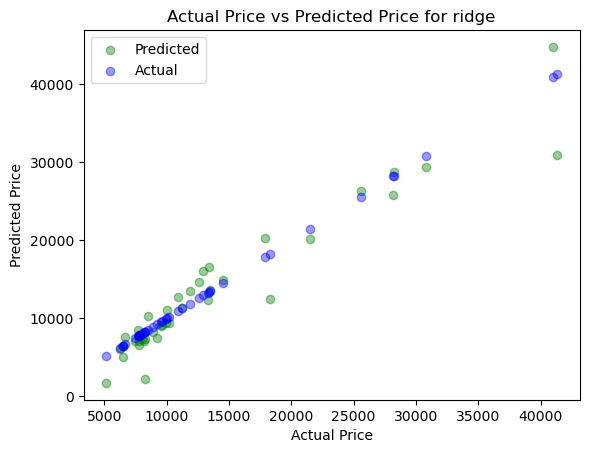
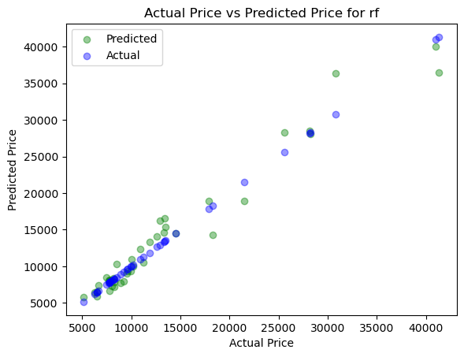
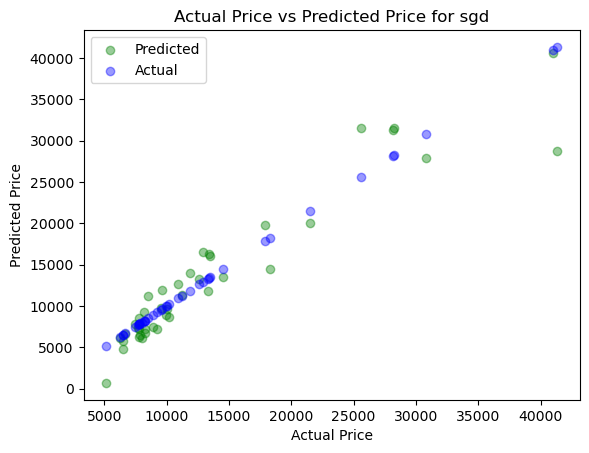
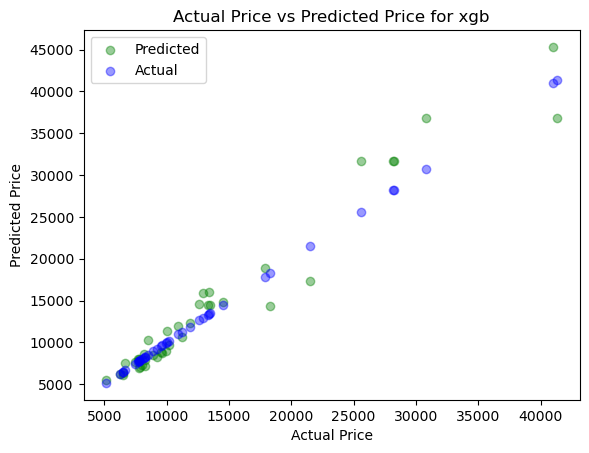

**Business Case**:
    
We will be working with a dataset provided by Geely Auto, a Chinese automotive company aspiring to enter the American market. They have collected a large dataset of different types of cars across the American market to understand the factors affecting car prices.
 

    We'll utilize this dataset to educate our model, tweaking the coefficients to reduce the discrepancy between the model's forecasts and the real car prices. Our aim is to pinpoint the key factors that influence a car's price and assess how effectively these factors can predict the price of a car.

**Github URL**
https://github.com/Pankil-Patel/Capstone/blob/main/capstone.ipynb

**Key Findings**
<li>Based on the evaluation, some key parameters were determined that had direct impact on the price of the car. Those parameters are
 <b>enginesize</b>, <b>horsepower</b>, <b>curbweight</b>, <b>carwidth</b> and <b>carlength</b>
 </li>
 <li> Below is the table that summarizes the results:
 <table border="1">
 <tr>
    <th>Model</th>
    <th>Best Parameters</th>
    <th>Best MSE</th>
    <th>Best MAE</th>
    <th>Best R2</th>
    <th>Plot</th>
</tr>
 <tr>
    <td>Linear Regression</td>
    <td>poly__degree: 1</td>
    <td>127800062.85</td>
    <td>7793.74</td>
    <td>-1.53</td>
    <td></img></td>
</tr>
 <tr>
    <td><b>Ridge Regression</b></td>
    <td>model__alpha: 100.0, poly__degree: 3</td>
    <td>4819752.60</td>
    <td>1581.03</td>
    <td>0.90</td>
    <td></img></td>
</tr>
 <tr>
    <td>Random Forest</td>
    <td>model__n_estimators: 150, poly__degree: 1</td>
    <td>5778855.86</td>
    <td>1536.41</td>
    <td>0.89</td>
    <td></img></td>
</tr>
 <tr>
    <td><b>Stochastic Gradient Descent</b></td>
    <td>model__alpha: 0.01, poly__degree: 1</td>
    <td>5056586.33</td>
    <td>1567.46</td>
    <td>0.91</td>
    <td></img></td>
</tr>
 <tr>
    <td>XGBoost</td>
    <td>model__learning_rate: 0.1, model__n_estimators: 200, poly__degree: 1</td>
    <td>6489479.25</td>
    <td>1654.82</td>
    <td>0.88</td>
    <td></img></td>
</tr>
</table>
</li>
<li>Based on the above results, we can predict that by using one of Stochastic Gradient Descent model or Ridge Regression, we can predict the price of the car more accurately. 
</li>
